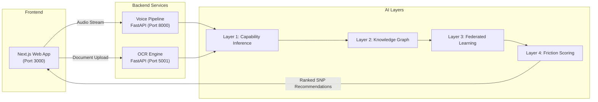
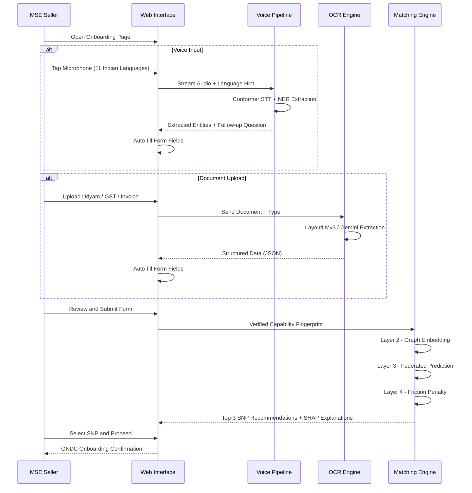
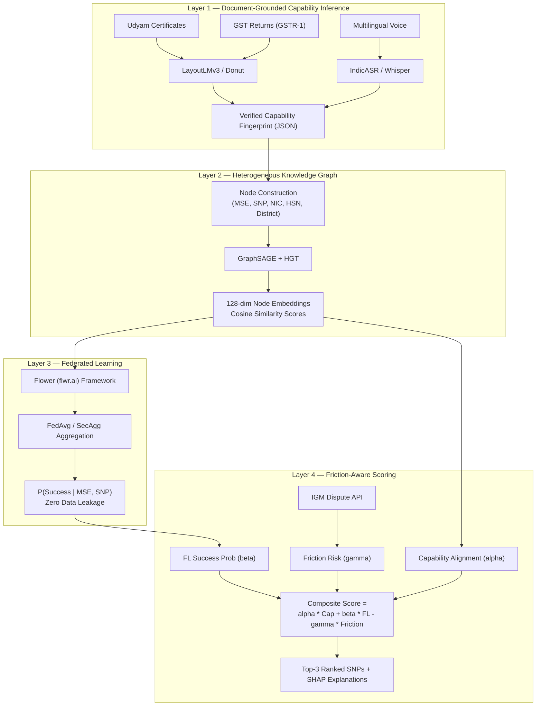

# MSME-Graph: Federated Capability Intelligence for ONDC Onboarding

**IndiaAI Innovation Challenge 2026 | Problem Statement 2 | Ministry of MSME**

An AI-powered MSE Agent Mapping Tool that automates and optimises the onboarding of Micro and Small Enterprises (MSEs) onto the Open Network for Digital Commerce (ONDC). The system replaces manual, error-prone processes with a 4-layer AI inference pipeline that infers capabilities from documents, constructs knowledge graphs, applies federated learning, and produces friction-aware ranked recommendations -- all fully compliant with the ONDC Beckn Protocol v1.2.0 and the Digital Personal Data Protection (DPDP) Act 2023.

---

## Table of Contents

- [Architecture Overview](#architecture-overview)
- [System Flow](#system-flow)
- [The 4-Layer AI Pipeline](#the-4-layer-ai-pipeline)
- [Repository Structure](#repository-structure)
- [Technology Stack](#technology-stack)
- [Getting Started](#getting-started)
- [API Reference](#api-reference)
- [ONDC and DPDP Compliance](#ondc-and-dpdp-compliance)
- [Testing](#testing)
- [License](#license)

---

## Architecture Overview

MSME-Graph is composed of three independently deployable services that communicate over REST APIs, orchestrated by a Next.js frontend that serves as the unified user interface.



---

## System Flow

The end-to-end user journey from initial data capture to SNP recommendation:



---

## The 4-Layer AI Pipeline

Each layer adds a distinct dimension of intelligence to the matching process.



### Layer Details

| Layer | Purpose | Models / Frameworks | Output |
|-------|---------|---------------------|--------|
| L1 | Document-Grounded Capability Inference | LayoutLMv3, Donut, IndicASR, Whisper | Verified Capability Fingerprint |
| L2 | Heterogeneous Knowledge Graph | GraphSAGE, HGT | 128-dim Inductive Embeddings |
| L3 | Federated SNP Performance Modelling | Flower, FedAvg, SecAgg | P(Success given MSE, SNP) |
| L4 | Friction-Aware Composite Scoring | SHAP, IGM API, Fairness Audit | Top-3 Ranked Recommendations |

---

## Repository Structure

```
aikosh/
|
|-- website/                    # Next.js 16 Frontend
|   |-- src/
|   |   |-- app/
|   |   |   |-- api/            # API route handlers (match, voice, ocr proxies)
|   |   |   |-- onboarding/     # Seller onboarding page
|   |   |   |-- globals.css     # Design system and component styles
|   |   |   +-- page.tsx        # Landing page (Hero, HowItWorks, Architecture, Stats)
|   |   +-- components/
|   |       |-- Architecture.tsx     # 4-layer AI pipeline section
|   |       |-- DocumentUpload.tsx   # OCR document upload with auto-fill
|   |       |-- Hero.tsx             # Landing page hero section
|   |       |-- HowItWorks.tsx       # User-facing 4-step flow
|   |       |-- ImpactStats.tsx      # Animated statistics counters
|   |       |-- MatchResults.tsx     # Layer 2/3/4 visualisation and SNP cards
|   |       |-- OnboardingForm.tsx   # Glassmorphic data capture form
|   |       +-- VoiceOnboarding.tsx  # Multilingual voice input with conversation UI
|   +-- package.json
|
|-- voice_pipeline/             # FastAPI Voice Processing Service
|   |-- stt/                    # Speech-to-Text (Conformer / Whisper wrappers)
|   |-- nlp/                    # NER and entity extraction
|   |-- tts/                    # Text-to-Speech for follow-up questions
|   |-- conversation/           # Multi-turn follow-up question logic
|   |-- schemas/                # JSON schemas for input/output validation
|   |-- fingerprint_merger.py   # Merges voice + OCR data into unified fingerprint
|   |-- main.py                 # FastAPI application entry point
|   +-- requirements.txt
|
|-- ocr-engine/                 # FastAPI Document AI Service
|   |-- extractors/             # Gemini-based extraction logic
|   |-- parsers/                # Document-type-specific parsers (Udyam, GST, Invoice, Bank)
|   |-- engine.py               # Core OCR orchestration engine
|   |-- main.py                 # FastAPI application entry point
|   +-- requirements.txt
|
|-- project.md                  # Architecture specification document
+-- test_integration.py         # End-to-end integration tests
```

---

## Technology Stack

### Frontend

| Technology | Version | Purpose |
|-----------|---------|---------|
| Next.js | 16.1.6 | React framework with API routes and SSR |
| React | 19.2.3 | Component-based UI library |
| TypeScript | 5.x | Type-safe development |
| CSS (Vanilla) | -- | Custom design system with CSS variables |
| Font Awesome | 6.x | Icon library (CDN) |

### Voice Pipeline

| Technology | Version | Purpose |
|-----------|---------|---------|
| FastAPI | 0.115.6 | High-performance async API server |
| PyTorch | 2.1+ | Neural network inference runtime |
| Transformers (HF) | 4.37+ | Pre-trained model loading (Conformer, Whisper) |
| torchaudio | 2.1+ | Audio processing and feature extraction |
| librosa | 0.10+ | Audio analysis and preprocessing |
| pydub | 0.25+ | Audio format conversion |

### OCR Engine

| Technology | Version | Purpose |
|-----------|---------|---------|
| FastAPI | -- | API server |
| Google Generative AI | 0.4+ | Gemini-based document extraction |
| pypdfium2 | 4.30 | PDF to image conversion (no Poppler dependency) |
| Pillow | 10.0+ | Image processing |
| Transformers (HF) | 4.35+ | LayoutLMv3 document understanding |

### AI / ML Models

| Model | Source | Layer | Function |
|-------|--------|-------|----------|
| LayoutLMv3 | Microsoft | L1 | Structured document parsing |
| Donut | NAVER | L1 | OCR-free document understanding |
| IndicASR | AI4Bharat | L1 | Indic language speech recognition |
| Whisper | OpenAI | L1 | Multilingual speech-to-text |
| GraphSAGE | Stanford | L2 | Inductive graph embeddings |
| HGT | Microsoft | L2 | Heterogeneous graph attention |
| Flower | flwr.ai | L3 | Federated learning framework |
| FedAvg / SecAgg | -- | L3 | Aggregation strategies |
| SHAP | -- | L4 | Model explainability |

---

## Getting Started

### Prerequisites

- Node.js 18+ and npm
- Python 3.10+
- GPU with CUDA support (recommended for voice pipeline inference)

### 1. Clone the Repository

```bash
git clone https://github.com/nahmahn/ai_kosh.git
cd ai_kosh
```

### 2. Start the Frontend

```bash
cd website
npm install
npm run dev
```

The web application will be available at `http://localhost:3000`.

### 3. Start the Voice Pipeline

```bash
cd voice_pipeline
pip install -r requirements.txt
python main.py
```

The voice API will be available at `http://localhost:8000`. On first run, model weights for Conformer/Whisper will be downloaded automatically.

### 4. Start the OCR Engine

```bash
cd ocr-engine
pip install -r requirements.txt
python main.py
```

The OCR API will be available at `http://localhost:5001`.

### Environment Variables

Each backend service uses a `.env` file for configuration:

**voice_pipeline/.env**
```
GROQ_API_KEY=<your-groq-api-key>
```

**ocr-engine/.env**
```
GEMINI_API_KEY=<your-gemini-api-key>
```

---

## API Reference

### Voice Pipeline (`http://localhost:8000`)

| Endpoint | Method | Description |
|----------|--------|-------------|
| `/api/voice/process` | POST | Process initial voice recording, extract entities |
| `/api/voice/followup` | POST | Process follow-up response in existing session |

**Request (multipart/form-data):**
- `audio` -- Audio file (WebM, WAV)
- `language_hint` -- ISO 639-1 language code (hi, ta, te, bn, etc.)
- `session_id` -- Session identifier (for follow-up only)

### OCR Engine (`http://localhost:5001`)

| Endpoint | Method | Description |
|----------|--------|-------------|
| `/api/ocr/process` | POST | Extract structured data from uploaded document |

**Request (multipart/form-data):**
- `file` -- Document file (PDF, PNG, JPG)
- `doc_type` -- One of: `auto`, `udyam`, `gst`, `invoice`, `bank`

### Match API (`http://localhost:3000/api/match`)

| Endpoint | Method | Description |
|----------|--------|-------------|
| `/api/match` | POST | Run 4-layer inference and return ranked SNP recommendations |

**Request (JSON):**
- Full seller profile data (enterprise name, products, turnover, etc.)

**Response includes:**
- `matches` -- Top-3 SNP recommendations with composite scores
- `layer2` -- Graph metadata, cosine similarity scores
- `layer3` -- Federated learning convergence and client data
- `layer4` -- Friction scoring breakdown with formula trace and fairness audit

---

## ONDC and DPDP Compliance

### ONDC Integration

The system sits upstream of the Beckn Protocol. Before recommending an SNP, it verifies live status via the `/subscribe` and `/lookup` endpoints of the ONDC registry. All data exchange follows the Beckn v1.2.0 specification.

### DPDP Act 2023 Compliance

| Principle | Implementation |
|-----------|---------------|
| Consent | Explicit consent log captured before any document upload or voice recording |
| Purpose Limitation | Capability fingerprint is used exclusively for SNP matching |
| Data Minimisation | Only business-relevant data is extracted; no irrelevant personal information |
| Cross-Entity Protection | Federated Learning ensures zero raw data transfer between SNPs |
| Audit Trail | All processing steps are logged with timestamps for regulatory review |

---

## Testing

### Integration Tests

```bash
python test_integration.py
```

### Voice Pipeline Tests

```bash
cd voice_pipeline
pytest tests/
```

### Frontend Lint

```bash
cd website
npm run lint
```

---

## Scoring Formula

The final composite score for each SNP recommendation is computed as:

```
Final_Score = (alpha * Capability_Alignment) + (beta * FL_Success_Prob) - (gamma * Friction_Risk)
```

Where:
- **alpha = 0.4** -- Weight for capability alignment (Layer 2 graph similarity)
- **beta = 0.4** -- Weight for federated success probability (Layer 3 prediction)
- **gamma = 0.2** -- Penalty for IGM dispute friction risk (Layer 4 deduction)

Each recommendation is accompanied by SHAP-based feature attributions explaining the score, and a fairness audit to ensure non-discrimination against women-led and SC/ST-owned enterprises.

---

## License

This project was developed for the IndiaAI Innovation Challenge 2026, Problem Statement 2, under the Ministry of MSME.

---

*Built with precision for India's MSME ecosystem.*
