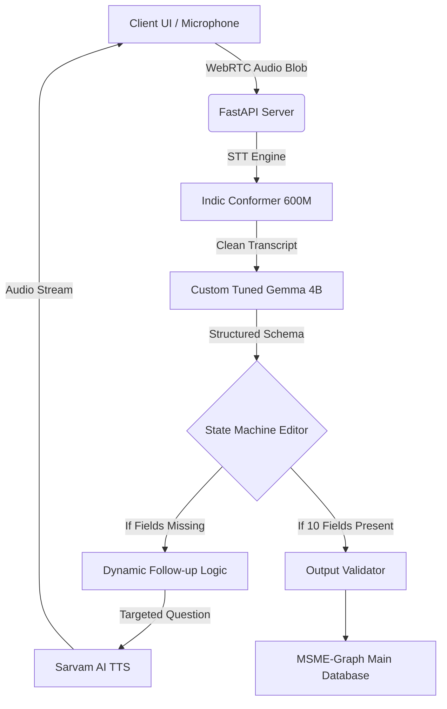
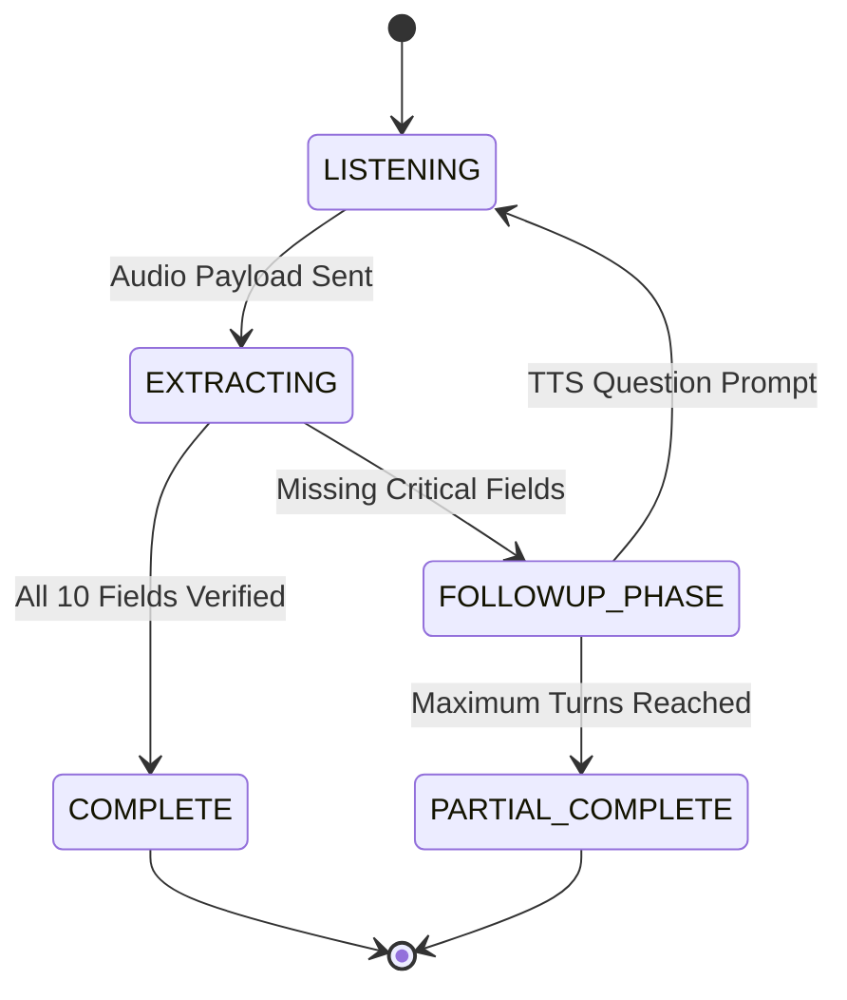

# MSME-Graph Conversational Voice Pipeline

## Overview
The MSME-Graph Voice Pipeline is an advanced, multilingual, multi-turn voice interface designed for micro, small, and medium enterprises. It enables unstructured audio input from business owners to be transcribed, semantically analyzed, and structured into an extensive 10-point JSON schema. The system dynamically generates follow-up questions to fill missing critical fields, driving a natural conversation until high data confidence is achieved.

## System Architecture

## Core Components

### 1. Speech-to-Text Transcription
The intake pipeline is powered by the `ai4bharat/indic-conformer-600m-multilingual` model. This model provides high-fidelity, GPU-accelerated transcription running on CUDA accelerators. It is highly optimized for recognizing Indian languages, regional dialects, and complex code-mixed utterances.

### 2. Natural Language Extraction (Custom-Tuned Gemma 4B)
The core semantic intelligence is driven by a custom-tuned Gemma 4B model functioning locally via Ollama. 
- **Precision Manufacturing Extraction:** The model has been aggressively prompted and tuned to isolate manufacturing and supply chain terminology, strictly extracting explicitly stated parameters to prevent statistical hallucination.
- **Strict JSON Structuring:** The output is heavily typed to return a comprehensive schema. 
- **Entity Disambiguation:** It independently segments raw materials from resultant products, separating inputs from outputs reliably across complex transcripts.

### 3. Recursive State Machine
The conversational context is maintained through a persistent session state engine. 
- Iteratively merges entity properties extracted across sequential voice turns, ensuring information density compounds rather than overwrites.
- Actively audits the working schema for critical missing dimensions.

### 4. Dynamic Iteration Loop

### 5. Multilingual Text-to-Speech
Outbound responses utilize the Sarvam AI synthesis engine. The pipeline triangulates the missing data point, references an internal multi-language matrix, and streams a natively accented voice directly to the client browser to maintain conversation fluidity.

## Execution Requirements

A conversation session is mathematically forced to continue looping through the `FOLLOWUP_PHASE` up to a maximum of six turns until the custom Gemma 4B engine successfully resolves all 10 of the following data anchors:

1. Enterprise Name
2. Product Descriptions
3. Manufacturing Process Keywords
4. Selling Channels / Buyer Types
5. Buyer Geographies Mentions
6. Employees Count
7. Years in Business
8. Daily Production Capacity
9. Factory Area Size
10. Major Machinery Used

Conversations passing this 10-point verification clear the NSIC Gate 3 confidence validation protocols.
